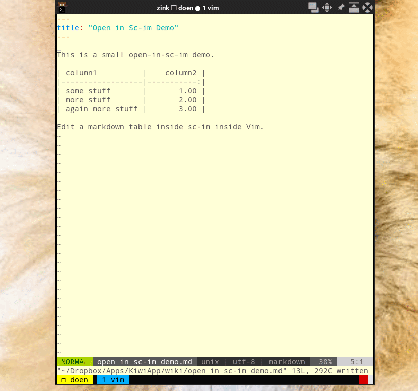
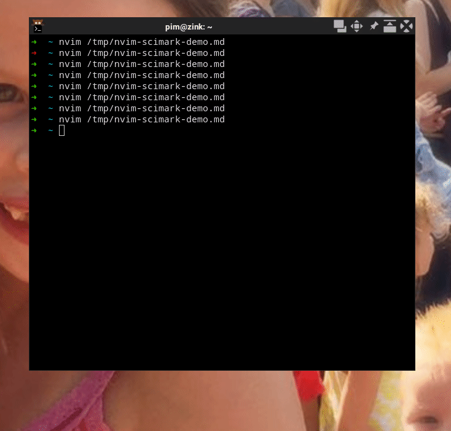

# Scimark

Edit embedded markdown tables with [SC-IM](https://github.com/andmarti1424/sc-im/) in a Vim terminal window.

## Prerequisites

You need [sc-im](https://github.com/andmarti1424/sc-im/wiki/Building-SC-IM) v0.82 or higher.

## Install

Install with a vim-plugin manager e.g.

```
Plug 'mipmip/vim-scimark'
```

## Usage

Point your cursor on a markdown table and press `<leader>sc`

From here you are inside sc-im.

The most minimal table scimark reckognizes is `||`.

See more in `:help Scimark`

## Demo's





